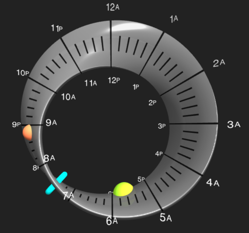

# CoolweirdClocks

**CoolweirdClocks** is a collection of unique time visualizations designed by Charlie Wallace. The app is a platform for various experimental clock designs that help you visualize time in new ways. See below for descriptions of the clocks included. Above: the DaySpiral clock.

## Platform Features

CoolweirdClocks provides a robust set of features common to all its clock designs:

- **Universal Location Detection**: Some clocks need your location, for example to calculate sunrise/sunset. Automatically detects your approximate location using IP geolocation for a seamless startup experience.
- **Precise GPS Location**: Optionally grant location permission for exact coordinates and the most accurate sunrise/sunset calculations (in Location Details dialog).
- **Manual Location Entry**: Enter any city name or manual coordinates (latitude, longitude, and GMT offset) to view the time anywhere in the world.
- **Clock Selector**: Easily switch between different clock designs (currently featuring DaySpiral and Mobius).
- **Zen Mode**: A minimalist mode that hides all UI controls for a clean, immersive visualization.
- **Full Screen Mode**: Useful for wall-mounted displays and mobile devices/small screens.
- **Privacy-First URL Persistence**: Your settings are preserved in the URL, so you can save and share your favorite clock settings via bookmarks, avoiding the need for cookies.

---

## Supported Clocks
- Clock-specific controls are found in the lower right corner.
- More weird clocks coming soon!

### DaySpiral Clock
A unique visualization that shows you your whole day, including day and night, sunrise and sunset. To show night and day you need a 24-hour clock; using a spiral is a way to squeeze 24 hours into the more-familiar 12-hour clock face. See screenshot above.
- **Sunset/Sunrise & Moon Phase**: Color-coded segments (light blue for day, dark blue for night) show the rhythm of the sun at your location; times of sunrise and sunset are displayed within the spiral. During the night, the periods when the moon has set are rendered in a darker color. Times of moonrise and moonset are also displayed if they happen during the night. A dynamic moon phase graphic displays the current phase of the moon.
- **Spiral Geometry**: The hour hand follows the spiral path, making two full turns to complete a day: one for AM and one for PM.
- **Ribbon Style**: An alternative style that embeds hour tick marks and numbers directly along the spiral track and eliminates the clock face for a simpler presentation.
- **Dual Location Mode**: Display the day and night of a second location on an inner spiral to compare time and sunlight across the world. Great for coordinating with a partner or family member who lives in a different time zone. Show both, or the second location only.
- **Both-Awake Line**: A green arc appears in dual mode to indicate when both locations are simultaneously in their "awake" hours (9 AM - 8 PM), making it easy to see when interaction is feasible.

**Specific URL Parameters:**
- `daySpiralStyle=SpiralHours`: Activates the "Ribbon" visual style.
- `daySpiralTimeFormat=24`: Sets the DaySpiral to 24-hour time format.
- `moon=0`: Disables the moon phase graphic and moon-down coloring on the night spiral.

### Mobius Clock

A 12-hour clock face where time moves along a fully three-dimensional Mobius strip (a strip with a single edge and a single surface).  You can even make it rotate in 3D space!
- **Hour shown on the edge**: The hour indicator moves along the edge of the strip, requiring two full loops to return to the start. Thus you have 24 hours shown on a 12-hour clock face.
- **Minutes and seconds shown on the centerline**: The second and minute indicators move along the center line of the strip, thus only requiring one loop to complete.
- **Dali Mode**: A fluid clock animation inspired by Salvador Dalí. A standard Mobius strip has a half-twist, but this has one-and-a-half twists. Shows an animation of the strip twisting in 3D space.
- **Lots of customization**: You can change the shape of the hour, minute, and second indicators, select the ticks style and even make the strip rotate in 3D space.
- **Demo Mode**: Fast-motion demo clarifies how the normally slow-moving clock elements move.
- **Day/Night**: Color-coded segments (light blue for day, dark blue for night) show the rhythm of the sun at your location.

**Specific URL Parameters:**
- `clock=mobius`: Activates the Mobius clock.
- `timeStyle=[ampm|24h]`: Sets the label style.
- `shapeHours`, `shapeMinutes`, `shapeSeconds`: Customize the indicator shapes (e.g., `sphere`, `ring`, `outer-ring`).
- `rotation=1`: Enables the 3D rotation animation.
- `demo=1`: Activates fast-motion demo mode.
- `showHours=0`: Hides the hour number labels.
- `dali=1`: Activates the "Dali" melting clock 1 1/2 turn mode.
- `dayNight=1`: Enables the day/night color coding (off by default).

---

## Suggested Use Case

Have an old tablet? Convert it into a beautiful wall or shelf clock! Use **Zen Mode** for a clean look. Bookmark your favorite setup (e.g., `https://dayspiral.com/#clock=mobius&rotation=1&zen=1`) and set it as the device's home screen.

Try it here: [dayspiral.com/#clock=mobius&rotation=1&zen=1](https://dayspiral.com/#clock=mobius&rotation=1&zen=1)

## Technologies

- **p5.js**: 2D Canvas rendering and animation.
- **Three.js**: 3D rendering for complex geometries like the Mobius strip.
- **IP Geolocation**: `ipwho.is` for CORS-friendly automatic location detection.
- **OpenStreetMap & GeoNames**: For city lookup and accurate timezone data.
- **Astronomy Engine**: High-precision calculations for moon rise, set, and illumination phases.

## Credits

Created by Charlie Wallace of Carlsbad, CA. Copyright 2026. Gnu General Public License v3.0.
For artwork and other projects, visit [coolweird.com](https://www.coolweird.com).
Feedback is welcome via the **Contact Me** link in the About modal!
