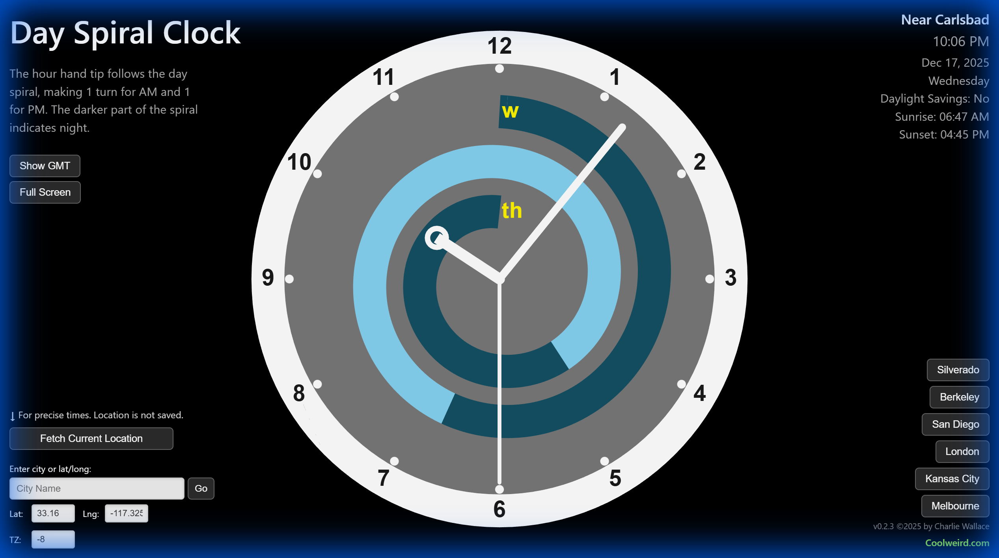

# Day Spiral Clock

A unique visualization of time using a spiral clock face that shows the full 24 hour day
coiled into a 12-hour clock face.  The spiral is color-coded to show the day and night
segments based on your location, thus indicating sunrise and sunset times.  

## Features

- **Spiral Clock Display**: Time displayed on a spiral that represents 24 hours on a 12-hour clock face.
- **Sunrise/Sunset Visualization**: Color-coded day (light blue) and night (dark blue) segments based on your location.
- **Responsive Mobile Design**: Optimized UI for both portrait and landscape mobile usage, with touch-friendly buttons.
- **Automatic Location**: Uses IP approximate geolocation for seamless startup (no permission prompt)
- **Precise Location Option**: Optional GPS coordinates for exact sunrise/sunset times (location is not saved)
- **VPN Detection**: Detects when timezone doesn't match browser timezone and prompts user to
      grant browser permission to access actual location for more accurate sunrise/sunset times. 
- **URL Location Sharing**: Location is embedded in URL, allowing bookmarkable and shareable links
- **Multiple Locations**: Quick-select buttons for major cities
- **Manual Entry**: Enter custom lat/long or city name
- **GMT Time Display**: Optional GMT hour labels on day spiral
- **Focus Mode**: Minimalist mode that hides UI controls for a cleaner visualization; toggled by the "Focus Mode" button (changes to "Show All" when active). Saved in URL for convenience.
- **Contact & Feedback**: Integrated contact form for user feedback and inquiries.

## Suggested Use Case

Have an old tablet? Convert it into a wall clock with a spiral face! Focus Mode is suggested for a simpler look. All that's needed is internet access and a web browser.  You can create a bookmark with `focus=1` in the URL and set it as the home screen for a minimalist clock experience.

## Available online

Visit [dayspiral.com](https://www.dayspiral.com)

## Location Sharing & Bookmarks

The app supports URL-based location persistence. When you select a location (GPS, city lookup, preset, or manual coordinates), the location details are automatically saved in the URL hash. Focus Mode too! This enables:

- **Bookmarking**: Save your favorite locations as browser bookmarks
- **Sharing**: Send URLs to others to show them a specific location
- **Quick Access**: Return to saved locations without re-entering coordinates

**Example URLs:**
- Boston: `https://www.dayspiral.com/#lat=42.359&lon=-71.058&tz=-5&city=boston`
- London: `https://www.dayspiral.com/#lat=51.507&lon=-0.127&tz=0&city=London`
- Focus Mode: `https://www.dayspiral.com/#focus=1`

**Note:** IP-based approximate locations are NOT saved to the URL automatically - only user-selected locations are persisted. This ensures your approximate location isn't inadvertently shared when copying URLs.

## Technologies

- **p5.js**: Canvas rendering and animation
- **IP Geolocation**: ipapi.co for automatic location detection
- **Location Services**: OpenStreetMap (Nominatim) for city lookup
- **Timezone Data**: GeoNames for accurate timezone information 

## Credits

Created by Charlie Wallace of Carlsbad, CA, copyright 2026.
For artwork by Charlie Wallace, see [coolweird.com](https://www.coolweird.com)
Check out my other clock: [mobiusclock.com](https://www.mobiusclock.com)

