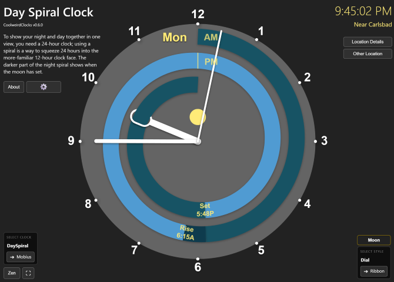

# CoolweirdClocks

**CoolweirdClocks** is a collection of unique time visualizations designed by Charlie Wallace. Originally starting with the Day Spiral Clock above, the app has evolved into a platform for various experimental clock designs that help you visualize time in new ways.

## Platform Features

CoolweirdClocks provides a robust set of features common to all its clock designs:

- **Universal Location Detection**: Some clocks need your location, for example to calculate sunrise/sunset. Automatically detects your approximate location using IP geolocation for a seamless startup experience.
- **Precise GPS Location**: Optionally grant location permission for exact coordinates and the most accurate sunrise/sunset calculations.
- **Manual Location Entry**: Enter any city name or manual coordinates (latitude, longitude, and GMT offset) to view the time anywhere in the world.
- **Clock Selector**: Easily switch between different clock designs (currently featuring DaySpiral and Mobius).
- **Zen Mode**: A minimalist mode that hides all UI controls for a clean, immersive visualization.
- **Full Screen Mode**: Useful for wall-mounted displays and mobile devices/small screens.
- **Privacy-First URL Persistence**: Share and bookmark your favorite clock settings without exposing your current location.

## URL "Hash" & Privacy

CoolweirdClocks uses a URL hash (e.g., `#clock=mobius&zen=1`) added to the end of the URL to persist your settings; no cookies are used. This allows you to preserve any setup by saving a bookmark or sharing a URL with others. You're in control; no user info goes to the server. No cookies are used.

### The Privacy Rule
- **Automatic locations are NOT saved to url**: Your approximate (IP-based) or precise (GPS-based) location is **never** added to the URL automatically. This ensures that when you copy a URL to share with others, you aren't inadvertently sharing your home coordinates.
- **Manual location selections ARE saved to url**: Only locations you intentionally choose—via preset buttons, city search, or manual coordinate entry—are saved to the URL. They are not saved anywhere else.
- **Settings are saved**: Choices like Zen mode, Clock selection, and clock-specific customizations are persisted in the URL only.

---

## Supported Clocks
- Clock-specific controls are found in the lower right corner.
- More weird clocks coming soon!

### DaySpiral Clock
A unique visualization that shows you your whole day, including day and night, sunrise and sunset, all in a 12-hour clock face. To show night and day you need a 24-hour clock; using a spiral is a way to squeeze 24 hours into the more-familiar 12-hour clock face.
- **Sunset/Sunrise**: Color-coded segments (light blue for day, dark blue for night) show the rhythm of the sun unique to your location.
- **Spiral Geometry**: The hour hand follows the spiral path, making two full turns to complete a day.
 
**"Classic" style**
- Provides a standard 12-hour clock face on the outside including the hour numbers, with the day spiral in the center. The tip of the hour hand follows along within the spiral.
- The "Show GMT" button optionally shows the GMT hours within the spiral. ('gmt=1' in url hash)

**"Hours In Spiral" style**
- Places the hours right into the spiral, clearly mapping out your day. All three of the hands follow the spiral.

### Mobius Clock
A 12-hour clock face where time moves along a fully three-dimensional Mobius strip (a strip with a single edge and a single surface).  You can even make it rotate in 3D space! 
- **Hour shown on the edge**: The hour indicator moves along the edge of the strip, requiring two full loops to return to the start. Thus you have 24 hours shown on a 12-hour clock face.
- **Minutes and seconds indicated along the strip's centerline**: Seconds and minutes move along the center line of the strip, thus only requiring one loop to complete.
- **Lots of customization**: The setup dialog lets you change the shape of the hour, minute, and second indicators, select the ticks style and choose am/pm vs 24-hour time.
- **Has it's own domain**: You can use 'mobiusclock.com' to get here; it redirects to dayspiral.com/#clock=mobius.

**Control Buttons for Mobius Clock (with url hash):**
- Rotate: Enables the 3D rotation animation. (`rotation=1`)
- Demo: Speeds up the hour and minute indicators to clarify how they move, so you don't have to wait around to see what they do. (`demo=1`)
- Hours: Shows 3D hour number labels floating next to the strip. (`showHours=1`)
- Day/Night: Colors the outer thirds of the strip to indicate day or night based on your location. ('dayNight=1')
- Dali: Adds an extra twist, with an animation that's mind-bending! ('dali=1') ...why dali? Because it's strange...

---

## Suggested Use Case

Have an old tablet? Convert it into a beautiful wall or shelf clock! Use **Zen Mode** for a clean look. Bookmark your favorite setup (e.g., `https://dayspiral.com/#clock=mobius&rotation=1&zen=1`) and set it as the device's home screen.

Try it here: [dayspiral.com/#clock=mobius&rotation=1&zen=1](https://dayspiral.com/#clock=mobius&rotation=1&zen=1)

## Technologies

- **p5.js**: 2D Canvas rendering and animation.
- **Three.js**: 3D rendering for complex geometries like the Mobius strip.
- **IP Geolocation**: `ipwho.is` for CORS-friendly automatic location detection.
- **OpenStreetMap & GeoNames**: For city lookup and accurate timezone data.

## Credits

Created by Charlie Wallace of Carlsbad, CA. Copyright 2026. Gnu General Public License v3.0.
For artwork and other projects, visit [coolweird.com](https://www.coolweird.com).
Feedback is welcome via the **Contact Me** link in the About modal!
